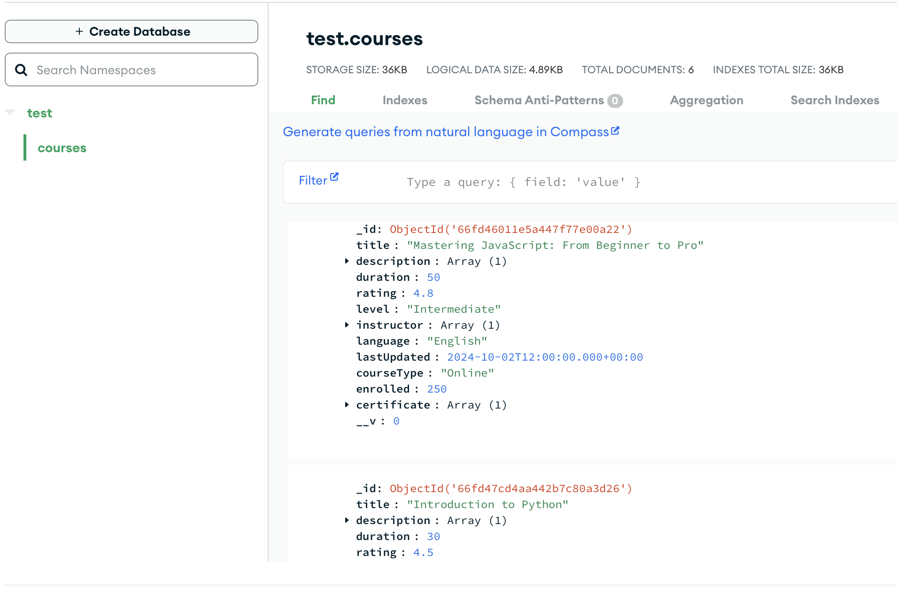
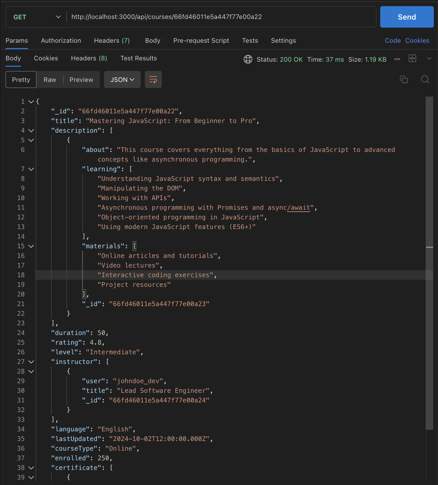
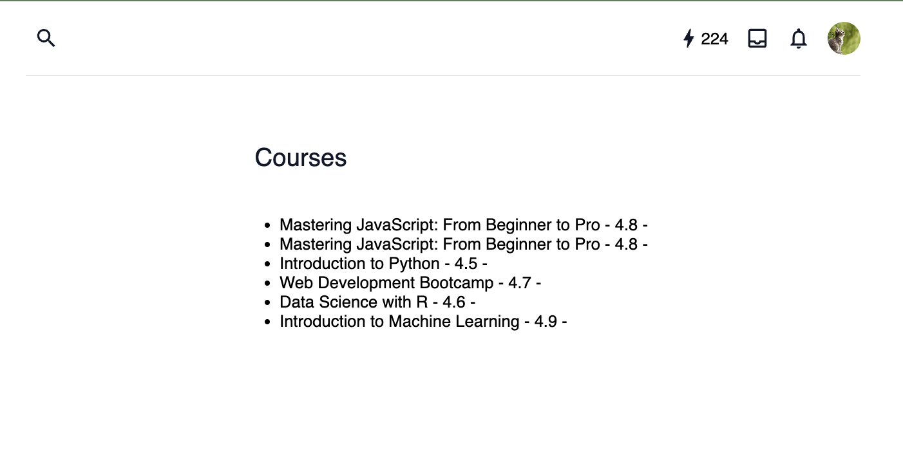

# Cheat Sheet: Connecting our Frontend and Backend

The goal of this doc is to provide a cheat sheet for how to connect our Vue.js frontend with the Express.js backend and MongoDB database. This uses the `Course` model as an example, but the same process can be applied for future models (Users, Lessons, etc.)


## Dependencies

### Backend

- **Express**: Streamlines the process of handling HTTP requests and routes
- **Mongoose**: Models schemas and adds structure for easier communication with MongoDB
- **dotenv**: For loading environment variables (like the MongoDB URI) securely
- **CORS**: Middleware to allow app to access resources from different domains

### Frontend

- **Axios**: Makes it easier to send HTTP requests to our API from the frontend

---

**Quick rundown of the process**

1. **Set up backend** (models, API endpoints in the controller, configure server to handle HTTP requests)
2. **Configure frontend** to be able to "talk" with the backend via axios

## 1. Set Up the Backend

### Main files

- index.js
- courseModel.js
- courseController.js
- courseRoutes.js

#### **index.js**

- Main entry point for backend
- Sets up the Express server and connects to MongoDB
  <br>

  ```javascript
  import mongoose from 'mongoose';
  import express from 'express';
  import dotenv from 'dotenv';
  import router from './src/routes/courseRoutes.js';
  import cors from 'cors';

  dotenv.config(); // Loads environment variables from the .env file.
  const app = express(); // Creates an instance of the express application.

  app.use(cors());
  app.use(express.json()); // Adds middleware to parse JSON data.
  app.use('/api/courses', router); // Sets up the course routes.

  // Connect to MongoDB
  const connectDB = async () => {
    try {
      await mongoose.connect(process.env.MONGODB_URI); // MONGODB_URI should be stored in .env file
      console.log('MongoDB connected');
    } catch (error) {
      console.error(`Error: ${error.message}`);
      process.exit(1);
    }
  };

  connectDB();

  const PORT = process.env.PORT || 3000;
  app.listen(PORT, () => {
    console.log(`Server now running on port ${PORT}`);
  });
  ```

      >> ***The MONGODB_URI can be found in the MongoDB Atlas site by going to the Cluster and clicking on*** `Connect` ***and then*** `Drivers`.

<br>

#### courseModel.js

Defines and exports the schema for the courses using Mongoose.

```javascript
import mongoose from 'mongoose';
const { Schema, model } = mongoose;

const courseSchema = new Schema({
  title: String,
  description: [{ about: String, learning: [String], materials: [String] }],
  duration: Number,
  rating: Number,
  level: String,
  instructor: [{ user: String, title: String }],
  language: String,
  lastUpdated: Date,
  courseType: String,
  enrolled: Number,
  certificate: [{ isLocked: Boolean }],
});

const Course = model('Course', courseSchema);
export default Course;
```

<br>

#### courseController.js

Handles the API logic for each of the HTTP requests

```javascript
import Course from '../models/courseModel.js';

// GET all courses
export const getCourses = async (req, res) => {
  try {
    const courses = await Course.find();
    if (!courses) {
      res.status(404).json({ message: 'No courses' });
    } else {
      res.json(courses);
    }
  } catch (error) {
    res.status(500).json({ message: error.message });
  }
};

// GET a single course by its ID
export const getCourseID = async (req, res) => {
  try {
    const courseID = req.params.id; // Gets the course ID from the request parameters.
    const course = await Course.findById(courseID); // Finds a course by its ID.
    if (course) {
      res.json(course); // Returns the course as JSON.
    } else {
      res.status(404).json({ message: 'Course not found' });
    }
  } catch (error) {
    res.status(500).json({ message: error.message }); // Returns an error message if there is a server error.
  }
};

// POST create a single course
export const createCourse = async (req, res) => {
  const newCourse = new Course(req.body);
  try {
    const savedCourse = await newCourse.save();
    res.status(201).json(savedCourse);
  } catch (error) {
    res.status(500).json({ message: error.message });
  }
};
```

> > **_More HTTP request methods can be added on later as needed (ex. PUT request to modify courses, DELETE request to remove a course, etc.)_**

<br>

#### courseRoutes.js

Defines and exports the API endpoints. Helps keep the index.js file tidy by including all the routes pertaining to `Course` in this one file.

```javascript
import express from 'express';
import {
  createCourse,
  getCourses,
  getCourseID,
} from '../controllers/courseController.js';

const router = express.Router();

router.post('/', createCourse);
router.get('/', getCourses);
router.get('/:id', getCourseID);

// More routes can be added (i.e. router.delete('/:id', deleteCourseID))

export default router;
```

<br> 
<br>

## 2. Set Up the Frontend

### Main files

- api.js
- individual Vue components/views

For the purpose of this documentation, I created some mock data in the MongoDB database that mirrors our `Course` schema.


#### api.js

A file located in our Vue.js application that is responsible for setting up communication with the backend. Could be located in a services directory, for example `src/services/api.js`

Uses `axios` to easily connect with backend.

```javascript
import axios from 'axios';

// will eventually be our actual deployed URL
const API_URL = 'http://localhost:3000/api/courses';

export const getCourses = async () => {
  try {
    const response = await axios.get(API_URL);
    return response.data;
  } catch (error) {
    console.error('Error fetching courses:', error);
    throw error;
  }
};

export const createCourse = async (courseData) => {
  try {
    const response = await axios.post(API_URL, courseData);
    return response.data;
  } catch (error) {
    console.error('Error creating course:', error);
    throw error;
  }
};

export const getCourseById = async (courseId) => {
  try {
    const response = await axios.get(`${API_URL}/${courseId}`);
    return response.data;
  } catch (error) {
    console.error('Error fetching course by ID:', error);
    throw error;
  }
};
```

<br>

#### Testing the API

**First, make sure both your backend and frontend servers are running**

**Use a tool like Postman to quickly test endpoints**

Here, I submit a GET request to the `/api/courses/:id` input with the id of one of the courses in the database.
The id in this case is '66fd46011e5a447f77e00a22', as you can see in the data and at the end of the url request.


<br>

#### Individual Vue components/views

In a Vue component, you can import and use the API service by first importing whichever methods you need from the `api.js` file. In this example, we are importing the `getCourseById` method.

```javascript

<template>
  <section>
      <div>
        <h1>Courses</h1>
        <ul>
          <li v-for="course in courses" :key="course._id">
            {{ course.title }} - {{ course.rating }} -
          </li>
        </ul>
      </div>
  </section>
</template>

<script setup>
import { ref, onMounted } from 'vue';
import { fetchCourses } from '../services/api.js';

const courses = ref([]);

onMounted(async () => {
  try {
    courses.value = await fetchCourses();
    console.log(courses.value);
  } catch (error) {
    console.error('Failed to fetch courses: ', error);
  }
});

</script>

```

**Rendered View that pulls course title and rating from database and displays**

